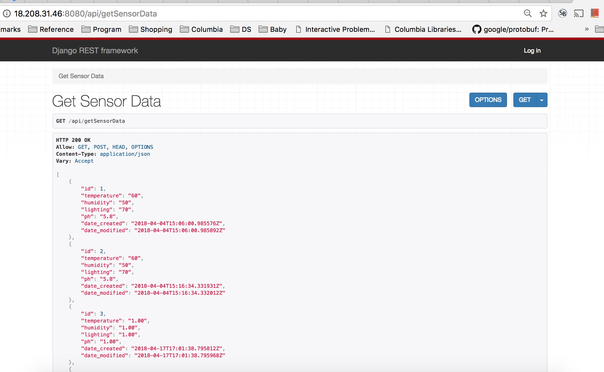
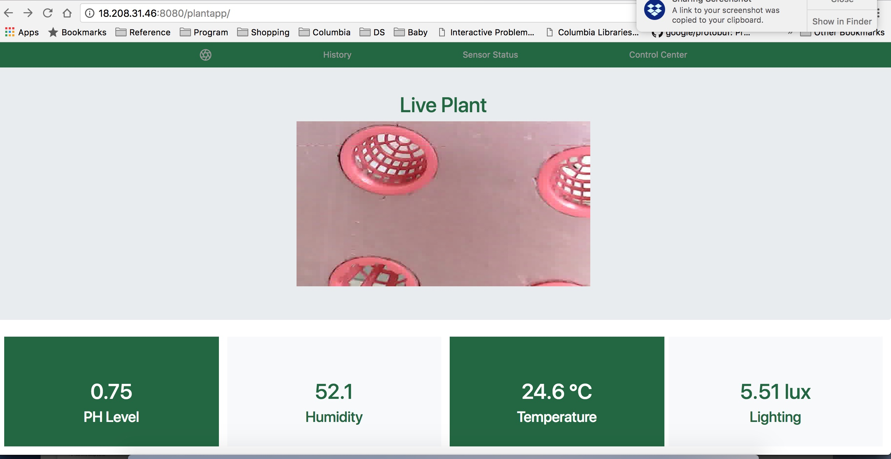
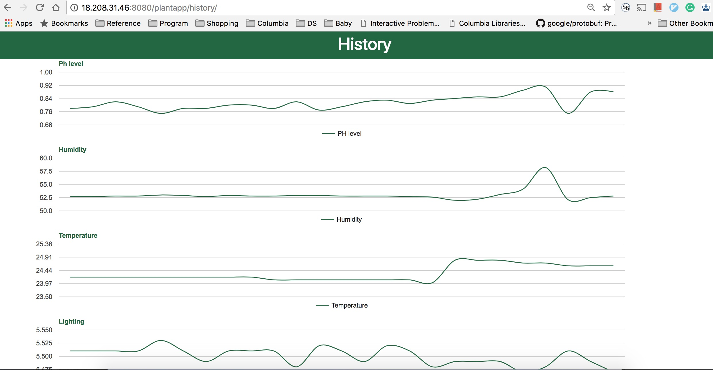
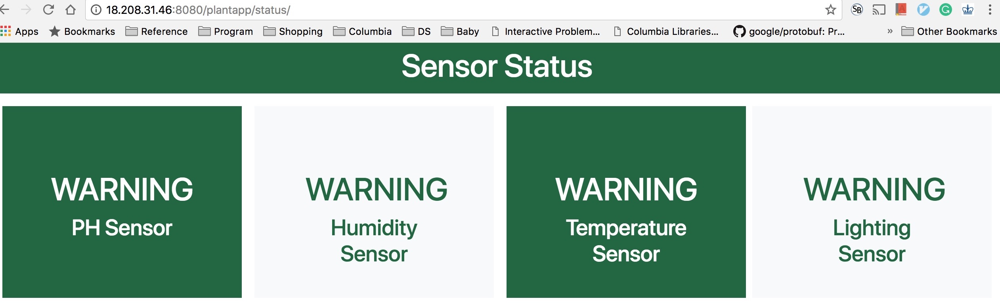
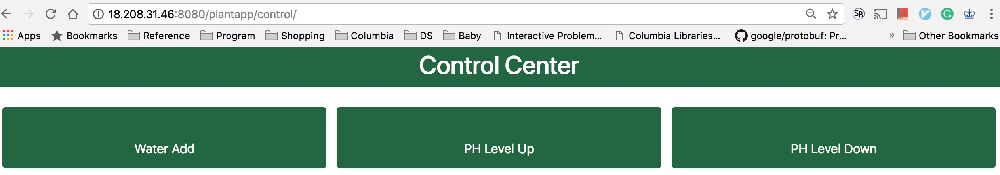

# django-plant
Use Google Map API to show route

## Steup
python3 -m venv env 
source env/bin/activate 
pip install -r requirements.txt 
python manage.py runserver 0.0.0.0:8080 (if run on EC2)

## User Guide
1. APIs  
=>http://127.0.0.1:8000/api/getSensorData  
=>http://127.0.0.1:8000/api/setSensorData  

1. http://127.0.0.1:8000/plantapp 
2. Home Page  
=>Show the current data got from the sensors. Also show the live video streaming.

3. History  
=>Show all the history sensor data
 

4. Sensor Status  
=>Show current sensors: ON/WARNING/OFF
 

5. Control  
=>Send control message to sensors
 

## License

    Copyright 2015 Siao-Ting Wang

    Licensed under the Apache License, Version 2.0 (the "License");
    you may not use this file except in compliance with the License.
    You may obtain a copy of the License at

       http://www.apache.org/licenses/LICENSE-2.0

    Unless required by applicable law or agreed to in writing, software
    distributed under the License is distributed on an "AS IS" BASIS,
    WITHOUT WARRANTIES OR CONDITIONS OF ANY KIND, either express or implied.
    See the License for the specific language governing permissions and
    limitations under the License.

